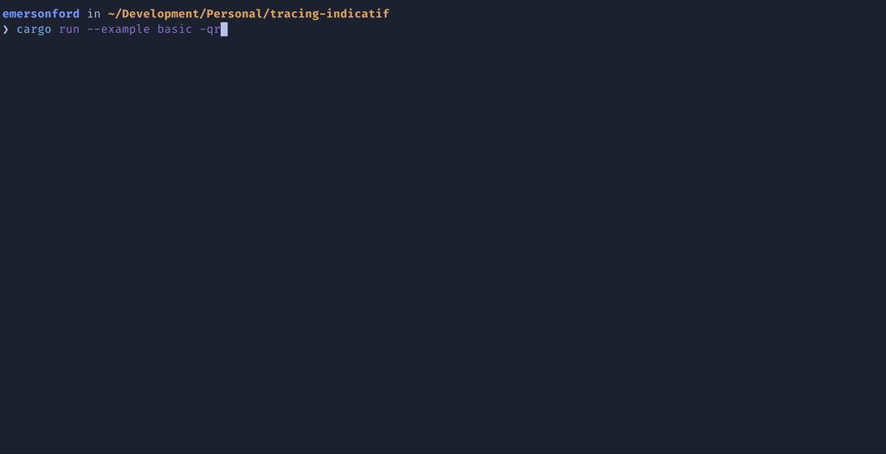
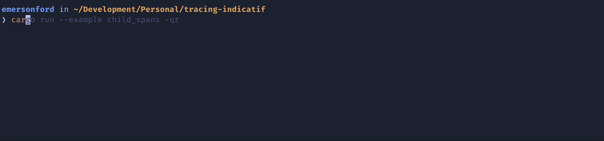

# tracing-indicatif
A [tracing](https://docs.rs/tracing/latest/tracing/) layer that automatically creates and manages [indicatif](https://docs.rs/indicatif/latest/indicatif/index.html) progress bars for active spans.

Progress bars are a great way to make your CLIs feel more responsive. However,
adding and managing progress bars in your libraries can be invasive, unergonomic,
and difficult to keep track of.

This library mains to make it easy to show progress bars for your CLI by tying
progress bars to [tracing spans](https://docs.rs/tracing/latest/tracing/#spans).
For CLIs/libraries already using tracing spans, this allow for a dead simple (3
line) code change to enable a smooth progress bar experience for your program.

This ends up working quite well as progress bars are fundamentally tracking the
lifetime of some "span" (whether that "span" is defined explicitly or implicitly).

## Demo
See the [`examples`](https://github.com/emersonford/tracing-indicatif/tree/main/examples)
folder for demo code.

### Default Configuration

### Default Configuration with Child Spans

### Build Console Like
A recreation of `buck2`'s [superconsole](https://github.com/facebookincubator/superconsole).

